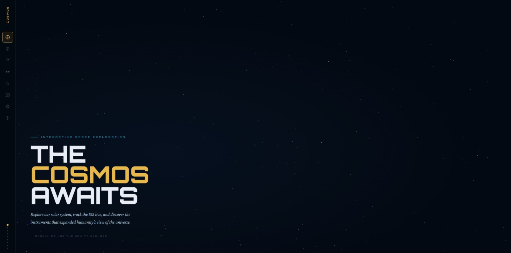

# COSMOS — Interactive Space Exploration Hub

A single-file, interactive space exploration website. No build tools, no dependencies to install — just open `cosmos.html` in a browser or drop it on any static host.



---

## Features

### 🪐 Interactive Solar System
A real-time animated model of the solar system rendered on an HTML5 canvas. Hover over any body for key facts. Use the zoom slider to transition from the inner planets all the way out to the Kuiper Belt and dwarf planets (Pluto, Eris, Haumea, Makemake). The asteroid belt, belt objects (Ceres, Vesta, Pallas, Psyche), and Kuiper Belt particles are all rendered with fade-in/out as you zoom.

### ☄️ Notable Wanderers
Six of the most significant comets and interstellar visitors ever observed — Halley's Comet, Shoemaker–Levy 9, ʻOumuamua, Hale–Bopp, 67P/Churyumov–Gerasimenko, and Borisov. Each card loads a real NASA image from the NASA Image and Video Library, with a custom canvas illustration as an instant placeholder while the photo loads.

### 🛰️ ISS Live Tracker
Real-time International Space Station position on a live dark-mode map (CartoDB). Updates every 5 seconds via the [wheretheiss.at](https://wheretheiss.at) API. Displays current latitude, longitude, altitude, and velocity. The ISS icon is an SVG representation of the actual station silhouette — not an emoji.

### 🔭 Great Observatories
An interactive canvas diagram showing the orbital positions of six major observatories — JWST at L2, Hubble in LEO, Chandra in HEO, and ground-based VLT, Keck, and ALMA on Earth's surface. Click any marker or legend item to reveal detailed information about the instrument.

### 🌌 Today in Space (APOD)
NASA's Astronomy Picture of the Day, displayed full-screen with the image on the left and title, description, and credit on the right. Handles both image and video (YouTube) entries. Uses a two-step fetch strategy — NASA API first, then a direct scrape of `apod.nasa.gov` as fallback — so it works even when the DEMO_KEY is rate-limited.

### ☄️ Near-Earth Objects
Live feed of asteroid and comet close approaches in the next 7 days. Also uses a two-step strategy: NASA NeoWs API first, then JPL's Small Body Database Close Approach API as fallback (routed through an allorigins CORS proxy since JPL doesn't send CORS headers). Potentially hazardous objects are flagged with a warning badge.

### ⚖️ Gravity Calculator
Enter your weight in kg or lbs and instantly see what you'd weigh on every major body in the solar system. Switching units auto-converts the input value. Results include a proportional bar visualisation.

---

## Navigation

The site uses **full-screen snap scrolling** — each section occupies exactly one viewport height, and scrolling or using the keyboard flips to the next section with a smooth snap. The left-hand icon nav provides one-click access to any section, with a tooltip on hover and a progress dot indicator at the bottom.

---

## Data Sources

| Feature | Source | API Key Required |
|---|---|---|
| ISS Position | [wheretheiss.at](https://wheretheiss.at/w/developer) | No |
| APOD | [api.nasa.gov/planetary/apod](https://api.nasa.gov) | DEMO_KEY (rate-limited) |
| APOD fallback | [apod.nasa.gov](https://apod.nasa.gov) via allorigins proxy | No |
| Near-Earth Objects | [api.nasa.gov/neo/rest/v1/feed](https://api.nasa.gov) | DEMO_KEY (rate-limited) |
| NEO fallback | [ssd-api.jpl.nasa.gov/cad.api](https://ssd-api.jpl.nasa.gov/doc/cad.html) via allorigins proxy | No |
| Wanderer Images | [images-api.nasa.gov](https://images.nasa.gov/docs/images.nasa.gov_api_docs.pdf) | No |
| Map tiles | [CartoDB Dark Matter](https://carto.com/basemaps/) | No |

All NASA public APIs are used with `DEMO_KEY`, which allows ~30 requests/hour per IP. For production use, register for a free key at [api.nasa.gov](https://api.nasa.gov) and replace `DEMO_KEY` in the two fetch calls.

---

## Getting a NASA API Key

1. Visit [https://api.nasa.gov](https://api.nasa.gov)
2. Fill in the sign-up form — instant approval, no payment required
3. In `cosmos.html`, search for `DEMO_KEY` (two occurrences) and replace with your key

```js
// APOD — around line 1077
const res = await fetch('https://api.nasa.gov/planetary/apod?api_key=YOUR_KEY_HERE');

// NEO — around line 1140
const url = `https://api.nasa.gov/neo/rest/v1/feed?...&api_key=YOUR_KEY_HERE`;
```

---

## Deployment

The entire site is a single HTML file with no build step.

**GitHub Pages**
```
1. Push cosmos.html to your repo (rename to index.html if desired)
2. Settings → Pages → Source: main branch / root
3. Done — live at https://yourusername.github.io/your-repo
```

**Any static host** (Netlify, Vercel, Cloudflare Pages)
Drop the file in, point the host at it. No configuration needed.

**Local**
```bash
# Any of these work:
open cosmos.html
python3 -m http.server 8080
npx serve .
```

> ⚠️ Opening the file directly as `file://` may block some API fetches due to browser CORS restrictions on local files. Use a local server for the best experience.

---

## Browser Support

All modern browsers (Chrome 90+, Firefox 88+, Safari 15+, Edge 90+). Requires support for:
- CSS `scroll-snap-type`
- HTML5 Canvas
- `IntersectionObserver`
- `fetch` / `async/await`

Mobile is supported but the layout is optimised for desktop viewports (1280px+). The left nav hides below 700px.

---

## External Libraries

Loaded via CDN — no local installation needed.

| Library | Version | Purpose |
|---|---|---|
| [Leaflet](https://leafletjs.com) | 1.9.4 | ISS map |
| [Google Fonts](https://fonts.google.com) | — | Orbitron, Crimson Pro |

---

## Credits

- All space imagery: NASA / ESA / JPL
- ISS tracking: [wheretheiss.at](https://wheretheiss.at)
- Map tiles: © [CartoDB](https://carto.com)
- CORS proxy: [allorigins.win](https://allorigins.win)

---

## License

MIT — do whatever you like with it. Attribution appreciated but not required.
